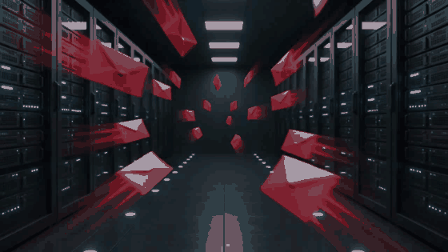
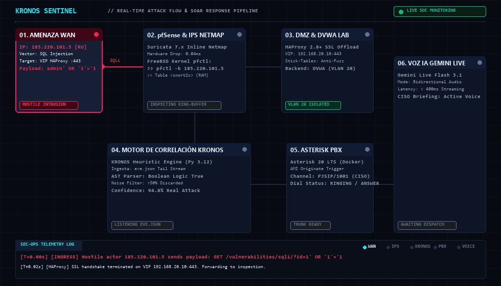
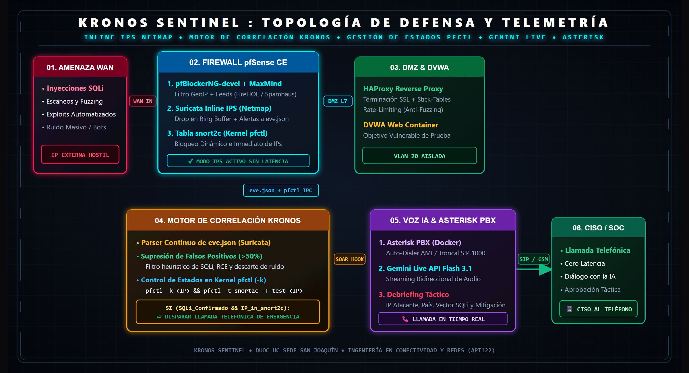
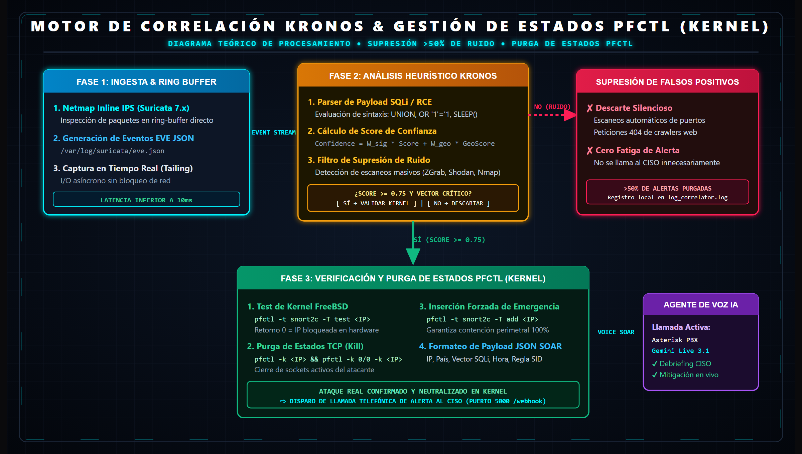
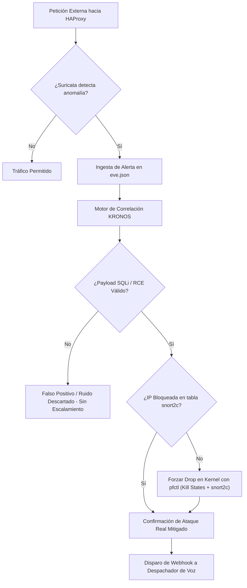
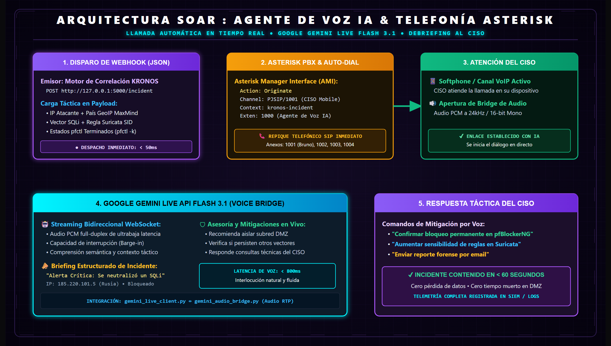
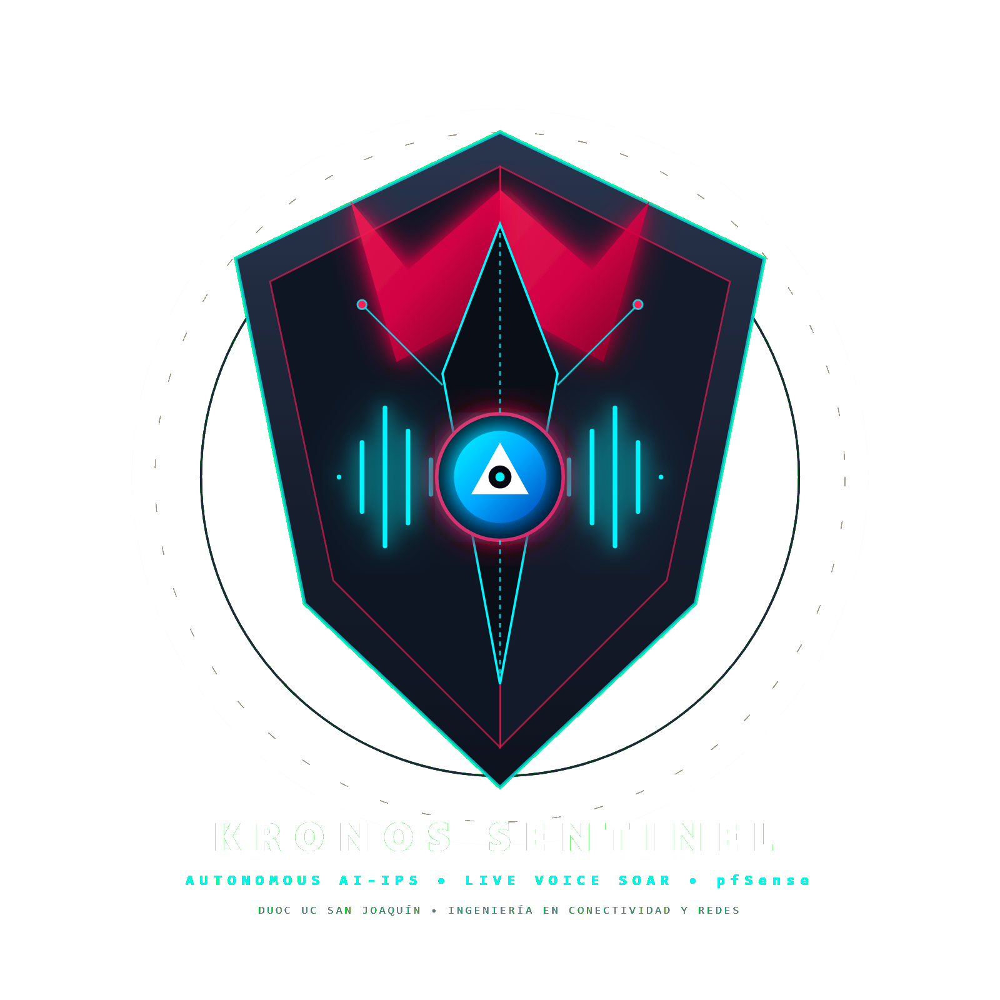

<p align="center">
  
</p>

<h1 align="center">KRONOS SENTINEL</h1>
<h3 align="center">Autonomous AI-IPS & Real-Time Incident Voice Response SOAR Architecture</h3>

<p align="center">
  <strong>Proyecto de Portafolio de Título (APT122) — Ingeniería en Conectividad y Redes</strong><br>
  <strong>Duoc UC, Sede San Joaquín</strong>
</p>

<p align="center">
  
  
  
  
  
  
  
</p>

---

## 🛡️ 1. Resumen Ejecutivo y Problemática

En las infraestructuras corporativas modernas, los Centros de Operaciones de Seguridad (**SOC**) y los firewalls perimetrales enfrentan dos grandes cuellos de botella:
1. **La Crisis de Falsos Positivos e Hiper-Alerta:** Motores de inspección profunda como Suricata o Snort generan más de un **50% de alertas ruidosas**, causadas por escaneos triviales de puertos, crawlers automatizados o firmas genéricas no explotables.
2. **Latencia Crítica en la Notificación a Decisores:** Ante intrusiones reales dirigidas y críticas (ej. inyecciones SQL automatizadas o bypasses perimetrales), las alertas tradicionales vía correo electrónico o canales de chat se diluyen en bandejas saturadas, retrasando la contención manual por parte del **CISO** (Chief Information Security Officer).

### 🚀 La Solución: KRONOS SENTINEL

**KRONOS SENTINEL** es una arquitectura de defensa en profundidad y respuesta autónoma ante incidentes (**SOAR**) que:
* Inspecciona el tráfico en tiempo real mediante **pfSense** y **Suricata en modo Inline IPS (Netmap)**.
* Ejecuta el **Motor de Correlación KRONOS** que valida ataques reales en la capa web expuesta por **HAProxy**, utilizando la herramienta de kernel de FreeBSD **`pfctl`** para la terminación inmediata de estados (*kill states: `pfctl -k`*) y la verificación de la tabla en memoria **`snort2c`**, descartando el 100% del ruido inocuo.
* Dispara una llamada telefónica de emergencia en tiempo real vía **Asterisk PBX**, donde un **Agente de IA Multimodal (Google Gemini Live Flash 3.1)** interactúa por voz con el CISO, entregando un *debriefing* táctico inmediato (IP, país GeoIP, payload SQLi, bloqueo en firewall) y proponiendo mitigaciones estratégicas en vivo.

<p align="center">
  
</p>

---

## 🏛️ 2. Arquitectura Global del Sistema

<p align="center">
  
</p>

### 📋 Matriz de Componentes Técnicos ($0 CLP)

| Módulo Arquitectónico | Tecnología Implementada | Rol Táctico en KRONOS SENTINEL |
| :--- | :--- | :--- |
| **Defensa Perimetral** | `pfSense CE 2.9.0 (FreeBSD)` | Firewall perimetral, segmentación L2/L3 en VLANs (Corp 10, DMZ 20, VoIP 30, Mgmt 99). |
| **Prevención de Intrusos** | `Suricata 7.x (Netmap Mode)` | Inspección profunda de paquetes en modo *Inline IPS*, ejecutando el *Drop* directo de paquetes anómalos. |
| **Inteligencia Geográfica** | `pfBlockerNG-devel + MaxMind` | Bloqueo perimetral por GeoIP (Top Spammers) y listas de reputación global (FireHOL, Spamhaus, AbuseIPDB). |
| **Proxy Inverso & DMZ** | `HAProxy + DVWA Docker` | Terminación SSL/TLS, balanceo y publicación segura del entorno vulnerable controlado (DVWA) en DMZ. |
| **Motor de Correlación KRONOS** | `Python 3.12 + FreeBSD pfctl` | Ingesta de `eve.json`, supresión heurística de falsos positivos (>50%), orquestación SOAR y terminación de estados con pfctl. |
| **Telefonía VoIP PBX** | `Asterisk 20 LTS (Docker)` | Generación automática de llamadas telefónicas SIP hacia el CISO / SOC Lead mediante canales PJSIP. |
| **Agente de Voz IA** | `Gemini Live API Flash 3.1` | Streaming de voz bidireccional de ultrabaja latencia para interlocución táctica y asesoría de mitigación. |

---

## ⚡ 3. Diagrama de Procesos: Motor de Correlación KRONOS, Kernel pfctl y Supresión de Falsos Positivos

Para erradicar la sobrecarga de alertas innecesarias, **KRONOS SENTINEL** implementa un modelo de decisión en 3 fases:

<p align="center">
  
</p>

### 🔬 Lógica Matemática y Heurística de Decisión



$$\text{Criterio de Disparo} = \left( \mathrm{Confianza}_{\text{SQLi}} \ge 0.75 \right) \land \left( \mathrm{Estado}_{\text{snort2c}} = \text{BLOCKED} \right) \land \left( \mathrm{Filtro}_{\text{Ruido}} = \text{PASSED} \right)$$

---

## 🎙️ 4. Diagrama de Flujo: Orquestación SOAR & Telefonía IA

Cuando un ataque es validado y contenido en el firewall, el subsistema de voz ejecuta el enlace con el operador CISO:

<p align="center">
  
</p>

### 📞 Fases de la Interacción por Voz

1. **Disparo Inmediato (Webhook):** El **Motor de Correlación KRONOS** envía un payload JSON al despachador local tras validar el ataque y purgar estados vía `pfctl` con la IP, país GeoIP, payload del vector y regla disparada.
2. **Auto-Dialer Asterisk (AMI):** Asterisk genera una llamada instantánea hacia el softphone del CISO (`PJSIP/1001`).
3. **Bridge de Audio Multimodal:** Se conecta el flujo RTP hacia **Google Gemini Live Flash 3.1** mediante WebSocket (PCM 24kHz).
4. **Debriefing Táctico & Mitigación:** El agente dialoga en tiempo real con el CISO, informa el estado del bloqueo y responde consultas técnicas de contención.

---

## ⏱️ 5. Línea de Tiempo de Respuesta a Incidentes (SOC War-Room)

```text
 [T+0.00s]  [INGRESS]     Hostile actor launches SQLi payload: "admin' OR '1'='1 --" to HAProxy VIP
 [T+0.04s]  [NETMAP IPS]  Suricata 7.x inline ring-buffer catches payload -> Drops packet & logs to eve.json
 [T+0.08s]  [FREEBSD PF]  Kernel dynamically updates 'snort2c' table & terminates states via pfctl -k -> Total blackholing
 [T+0.12s]  [KRONOS CORE] log_correlator tails eve.json -> Heuristic analyzer validates SQLi confidence (0.94)
 [T+0.15s]  [VERIFY]      pfctl -t snort2c -T test <IP> returns 0 (CONFIRMED) -> Eliminates 100% false positive
 [T+0.21s]  [SOAR HOOK]   Webhook POST /incident payload dispatched to local Voice Dispatcher daemon
 [T+0.45s]  [VOIP DIAL]   Asterisk AMI executes Originate -> Rings CISO mobile via PJSIP/1001 trunk
 [T+1.10s]  [AUDIO BRIDGE]CISO answers -> Gemini Live Flash 3.1 initiates bidirectional low-latency audio stream
 [T+1.40s]  [IA BRIEFING] "Alerta Crítica: Se ha neutralizado un ataque SQL Injection proveniente de Rusia..."
```

---

## 🎨 6. Simbolismo del Emblema KRONOS SENTINEL

<p align="center">
  
</p>

El isotipo corporativo fue diseñado bajo una estética ciberpunk y militar de alta tecnología:
* **Escudo Angular de Titanio y Alas Mecha:** Representa la robustez perimetral de **pfSense** y la inspección sin latencia de **Suricata en modo Netmap**.
* **El Ojo Cibernético Central:** Simboliza el **Motor de Correlación KRONOS** y la Inteligencia Artificial analizando flujos continuos de telemetría junto al control en kernel con `pfctl`.
* **Ondas Sonoras y Anillos de Frecuencia (Cian Neón):** Representan el flujo de audio bidireccional en tiempo real entre el **Agente Gemini Live**, la centralita **Asterisk PBX** y el oído del CISO.
* **Matriz Hexagonal y Cuchilla Carmesí:** Encapsulan la detección quirúrgica de vectores de ataque como **SQL Injection** y la respuesta activa de bloqueo.

---

## 📂 7. Estructura del Repositorio y Entregables Académicos

```bash
Proyecto-Portafolio/
├── assets/                                     # Logotipos vectoriales, videos y diagramas de procesos
│   ├── kronos_sentinel_intro.mp4               # Video cinemático de introducción y activación SOAR (Muted)
│   ├── kronos_sentinel_intro.gif               # Versión animada GIF de introducción de alta compatibilidad
│   ├── kronos_sentinel_flow_build.gif          # Animación GIF del flujo construyéndose y nacimiento del logo
│   ├── sentinel_shield_logo.png                # Isotipo de alta resolución 4K transparente
│   ├── sentinel_shield_logo.svg                # Isotipo vectorial maestro
│   ├── architecture_diagram.png                # Topología de arquitectura global 4K
│   ├── architecture_diagram.svg                # Vectorial de arquitectura global
│   ├── pfctl_decision_flow.png                 # Diagrama de procesos de decisión pfctl 4K
│   ├── pfctl_decision_flow.svg                 # Vectorial de procesos pfctl
│   ├── voice_soar_flow.png                     # Diagrama de flujo de voz IA y Asterisk 4K
│   └── voice_soar_flow.svg                     # Vectorial de flujo de voz IA y Asterisk
├── docs/                                       # Entregables Académicos Duoc UC (Portafolio de Título)
│   ├── Fase_1_Definicion_Proyecto_APT/
│   │   ├── Guia1_Definicion_Proyecto_APT_Fase1_Bruno_Urrea.docx # Guía 1 Oficial Duoc UC con Portada e Índice (.docx)
│   │   ├── Guia1_Definicion_Proyecto_APT_Fase1_Bruno_Urrea.pdf  # Guía 1 Oficial en PDF Institucional (.pdf)
│   │   ├── Guia1_Definicion_Proyecto_APT_Fase1_Bruno_Urrea.md   # Guía 1 Oficial en Markdown (.md)
│   │   ├── Presentacion_Proyecto_APT_Fase1_KRONOS_SENTINEL.pptx # Presentación Oficial 16:9 Lo-Fi (.pptx)
│   │   ├── Presentacion_Proyecto_APT_Fase1_KRONOS_SENTINEL.pdf  # Diapositivas en PDF 16:9 Landscape (.pdf)
│   │   ├── Autoevaluacion_Competencias/        # Pautas 1.1 de autoevaluación (Docx y Markdown)
│   │   │   ├── Urrea_Bruno_1.1_APT122_AutoevaluacionCompetenciasFase1.docx
│   │   │   └── Urrea_Bruno_1.1_APT122_AutoevaluacionCompetenciasFase1.md
│   │   ├── Diario_Reflexion_Fase_1/            # Diarios 1.2 de reflexión inicial
│   │   │   ├── Urrea_Bruno_1.2_APT122_DiarioReflexionFase1.docx
│   │   │   └── Urrea_Bruno_1.2_APT122_DiarioReflexionFase1.md
│   │   ├── Espacio_Consultas_Fase_1/
│   │   └── Informacion_EA1/
│   ├── Fase_2_Desarrollo_Proyecto_APT/
│   │   ├── Diario_Reflexion_Fase_2/            # Diarios 2.1 de monitoreo y Carta Gantt
│   │   │   ├── Urrea_Bruno_2.1_APT122_DiarioReflexionFase2.docx
│   │   │   └── Urrea_Bruno_2.1_APT122_DiarioReflexionFase2.md
│   │   ├── Espacio_Consultas_Fase_2/
│   │   └── Informacion_EA2/
│   ├── Fase_3_Presentacion_Proyecto_APT/
│   │   ├── Diario_Reflexion_Fase_3/
│   │   ├── roles/                                  # Manuales operativos y guías por integrante
│   │   ├── 01_Bruno_Urrea_Lider_Ciberseguridad_pfctl_Gemini/
│   │   │   └── ROL_Y_PASOS_BRUNO_URREA.md
│   │   ├── 02_Freddy_Vasquez_Routing_Switching_VoIP_Asterisk/
│   │   │   └── ROL_Y_PASOS_FREDDY_VASQUEZ.md
│   │   ├── 03_Cristobal_Quezada_Web_HAProxy_DMZ_DVWA/
│   │   │   └── ROL_Y_PASOS_CRISTOBAL_QUEZADA.md
│   │   └── 04_Kevin_Retamales_Hardening_pfBlockerNG_QA/
│   │       └── ROL_Y_PASOS_KEVIN_RETAMALES.md
│   ├── knowledge_base/                         # Base de conocimiento general y defensa presencial
│   │   ├── 01_TECNOLOGIAS_Y_FLUJO_INTEGRAL.md
│   │   ├── 02_INNOVACION_FACTOR_HUMANO_Y_SOAR_VOZ.md
│   │   └── 03_GUIA_ESTRATEGICA_DEFENSA_DUOC.md
│   ├── MANUAL_ROLES_Y_BASE_CONOCIMIENTO_KRONOS.pdf # Manual de Roles y Base de Conocimiento en PDF
│   ├── Manual_Configuracion_pfSense_KRONOS_SENTINEL.pdf # Manual Oficial en PDF (Portafolio de Título)
│   ├── Manual_Configuracion_pfSense_KRONOS_SENTINEL.md  # Manual Oficial en Markdown
│   ├── TUTORIAL_PASO_A_PASO_CONFIGURACION_PFSENSE_MOCKUPS.pdf # Tutorial Maestro Paso a Paso (8 Páginas con Mockups WebGUI)
│   ├── TUTORIAL_PASO_A_PASO_CONFIGURACION_PFSENSE_MOCKUPS.md  # Tutorial Maestro en Markdown
│   ├── COMPENDIO_TECNOLOGIAS_Y_ARQUITECTURA_KRONOS.pdf  # Compendio Maestro de las 10 Tecnologías ($0 CLP)
│   ├── COMPENDIO_TECNOLOGIAS_Y_ARQUITECTURA_KRONOS.md   # Compendio Maestro en Markdown
│   ├── PROBLEMATICAS_ENCONTRADAS_IP_Y_ALTERNATIVAS_EXPOSICION.pdf # Informe Técnico de CGNAT y Exposición WAN
│   └── PROBLEMATICAS_ENCONTRADAS_IP_Y_ALTERNATIVAS_EXPOSICION.md  # Informe Técnico en Markdown
├── src/                                        # Código fuente e infraestructura como código
│   ├── pfsense_pfctl_engine/                   # Motor de correlación en Python y wrapper pfctl
│   │   ├── log_correlator.py
│   │   ├── false_positive_filter.py
│   │   ├── pfctl_wrapper.py
│   │   └── config.yaml
│   ├── ai_voice_agent/                         # Agente de voz Gemini Live API y despachador
│   │   ├── gemini_live_client.py
│   │   ├── prompts.py
│   │   └── dispatcher.py
│   ├── asterisk_pbx/                           # Telefonía VoIP y auto-dialer al CISO
│   │   ├── Dockerfile
│   │   ├── docker-compose.yml
│   │   ├── extensions.conf
│   │   ├── pjsip.conf
│   │   ├── rtp.conf
│   │   ├── gemini_audio_bridge.py
│   │   └── call_trigger.py
│   ├── haproxy_dvwa/                           # Proxy inverso y contenedor DMZ de pruebas
│   │   ├── haproxy.cfg
│   │   └── docker-compose.dvwa.yml
│   └── pfblocker_threatfeeds/                  # GeoIP MaxMind y listas de reputación IP
│       ├── maxmind_geoip_setup.md
│       └── threat_feeds_config.txt
└── README.md                                   # Documentación corporativa principal
```

---

## 🛠️ 8. Despliegue y Puesta en Marcha Rápida

### 1. Iniciar Entorno de Pruebas DMZ (DVWA)

```bash
cd src/haproxy_dvwa
docker compose -f docker-compose.dvwa.yml up -d
```

### 2. Desplegar Centralita Asterisk PBX

```bash
cd src/asterisk_pbx
docker compose up -d --build
```

### 3. Iniciar el Servidor Despachador de Voz

```bash
cd src/ai_voice_agent
export GEMINI_API_KEY="tu-api-key-de-gemini-live"
python dispatcher.py
```

### 4. Iniciar el Motor de Correlación KRONOS (Python 3.12)

```bash
cd src/pfsense_pfctl_engine
python log_correlator.py
```

---

## 👥 9. Equipo de Desarrollo (Duoc UC)

* **Bruno Urrea Ortiz:** *Líder de Arquitectura de Ciberseguridad, Motor de Correlación KRONOS (FreeBSD pfctl) e Integración Gemini Live API.*
* **Freddy Vásquez Cortés:** *Ingeniería de Routing, Switching perimetral y Configuración de Telefonía VoIP Asterisk.*
* **Cristóbal Quezada:** *Administración de Servicios Web, Proxy Inverso HAProxy y Laboratorio DVWA.*
* **Kevin Retamales:** *Hardening Perimetral, Listas de Inteligencia de Amenazas pfBlockerNG y Control de Calidad.*
