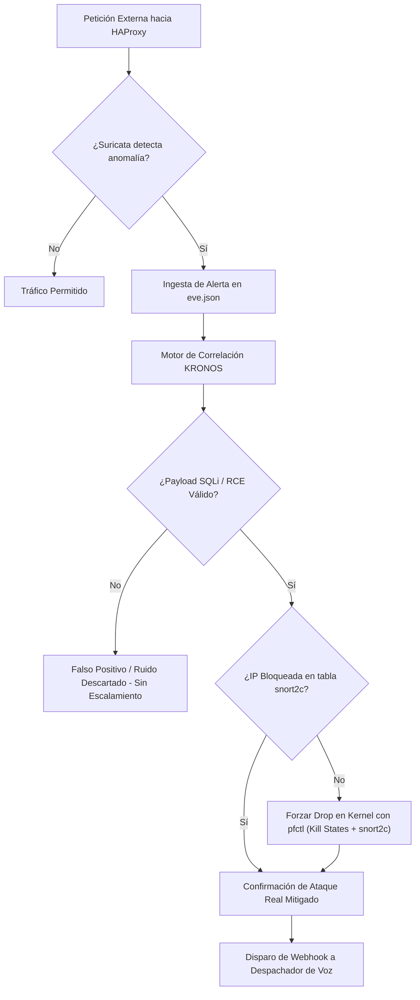
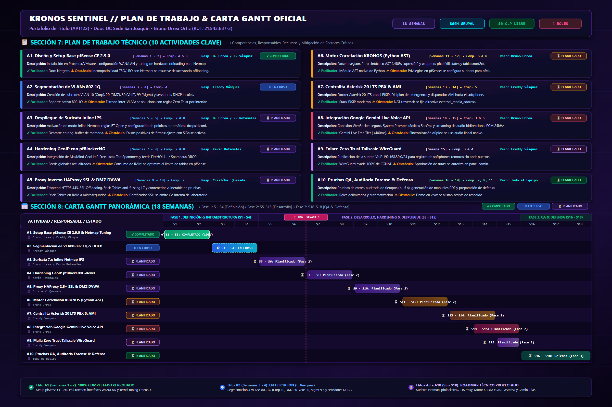

<p align="center">
  
</p>

<h1 align="center">KRONOS SENTINEL</h1>
<h3 align="center">Autonomous AI-IPS & Real-Time Incident Voice Response SOAR Architecture</h3>

<p align="center">
  <strong>Proyecto de Portafolio de Título (APT122) — Ingeniería en Conectividad y Redes</strong><br>
  <strong>Duoc UC, Sede San Joaquín</strong>
</p>

<p align="center">
  
  
  
  
  
  
  
</p>

---

## 📌 Estado de Avance Real del Proyecto (Portafolio de Título APT122)

> **Institución:** Duoc UC — Sede San Joaquín | **Carrera:** Ingeniería en Conectividad y Redes  
> **Semestre Académico:** Segundo Semestre 2026 (Primavera 2026: Agosto – Diciembre 2026)  
> **Temporalidad Actual:** Semana 6 (21 al 27 de Septiembre 2026) • Transición Fase 1 (S1-S4) a Fase 2 (S5-S15)

| Fase del Proyecto | Temporalidad | Estado | Entregable / Hito Técnico Actual |
| :--- | :---: | :---: | :--- |
| **Fase 1: Definición & Infraestructura Base** | **Semanas 1 a 4** | **En Cierre** | • **Actividad A1 (S1 - S2):** ✔ **100% COMPLETADO Y PROBADO.** Despliegue pfSense CE 2.9.0 en Proxmox/VMware, conectividad WAN/LAN, tuning de kernel FreeBSD (`net.inet.ip.fastforwarding=0`), mbufs elevados y patch XML (en `src/pfsense_setup/`).<br>• **Actividad A2 (S3 - S4):** ⚙ **EN EJECUCIÓN.** Segmentación de 4 VLANs 802.1Q (Corp 10, DMZ 20, VoIP 30, Mgmt 99) y servidores DHCP por Freddy Vásquez. |
| **Fase 2: Desarrollo, Hardening & Despliegue** | **Semanas 5 a 15** | **Planificado (Roadmap)** | Módulos **A3 a A9** planificados para desarrollo progresivo según Carta Gantt: Suricata Inline Netmap IPS, pfBlockerNG GeoIP, HAProxy SSL & DVWA, Motor KRONOS Python AST, Asterisk PBX 20, Gemini Live Voice y Malla Tailscale WireGuard. |
| **Fase 3: QA, Auditoría & Defensa ante Comisión** | **Semanas 16 a 18** | **Planificado (Roadmap)** | Pruebas de penetración SQLi simuladas, verificación de descarte en kernel (<100 ms), medición de latencia (<1.5 s), manuales técnicos PDF y defensa final ante la comisión evaluadora. |

> ⚠️ **Aclaración Metodológica Importante:** La arquitectura global, diagramas de procesos y guías de prototipado documentados en este repositorio representan el **diseño técnico integral** aprobado para el ciclo semestral de 18 semanas de la asignatura Capstone. En estricto cumplimiento del cronograma académico, los servicios se implementan de manera modular: actualmente se encuentra **100% completado y probado el hito A1**, **en desarrollo el hito A2**, mientras que el resto de componentes se desarrollarán durante las semanas correspondientes de la Fase 2 y Fase 3.

---

## 🛡️ 1. Resumen Ejecutivo y Problemática

En las infraestructuras corporativas modernas, los Centros de Operaciones de Seguridad (**SOC**) y los firewalls perimetrales enfrentan dos grandes cuellos de botella:
1. **La Crisis de Falsos Positivos e Hiper-Alerta:** Motores de inspección profunda como Suricata o Snort generan más de un **50% de alertas ruidosas**, causadas por escaneos triviales de puertos, crawlers automatizados o firmas genéricas no explotables.
2. **Latencia Crítica en la Notificación a Decisores:** Ante intrusiones reales dirigidas y críticas (ej. inyecciones SQL automatizadas o bypasses perimetrales), las alertas tradicionales vía correo electrónico o canales de chat se diluyen en bandejas saturadas, retrasando la contención manual por parte del **CISO** (Chief Information Security Officer).

### 🚀 La Solución: KRONOS SENTINEL

**KRONOS SENTINEL** es una arquitectura de defensa en profundidad y respuesta autónoma ante incidentes (**SOAR**) que:
* Inspecciona el tráfico en tiempo real mediante **pfSense** y **Suricata en modo Inline IPS (Netmap)**.
* Ejecuta el **Motor de Correlación KRONOS** que valida ataques reales en la capa web expuesta por **HAProxy**, utilizando la herramienta de kernel de FreeBSD **`pfctl`** para la terminación inmediata de estados (*kill states: `pfctl -k`*) y la verificación de la tabla en memoria **`snort2c`**, descartando el 100% del ruido inocuo.
* Dispara una llamada telefónica de emergencia en tiempo real vía **Asterisk PBX**, donde un **Agente de IA Multimodal (Google Gemini Live Flash 3.1)** interactúa por voz con el CISO, entregando un *debriefing* táctico inmediato (IP, país GeoIP, payload SQLi, bloqueo en firewall) y proponiendo mitigaciones estratégicas en vivo.

<p align="center">
  
</p>

---

## 🏛️ 2. Arquitectura Global del Sistema

<p align="center">
  
</p>

### 📋 Matriz de Componentes Técnicos ($0 CLP)

| Módulo Arquitectónico | Tecnología Implementada | Rol Táctico en KRONOS SENTINEL |
| :--- | :--- | :--- |
| **Defensa Perimetral** | `pfSense CE 2.9.0 (FreeBSD)` | Firewall perimetral, segmentación L2/L3 en VLANs (Corp 10, DMZ 20, VoIP 30, Mgmt 99). |
| **Prevención de Intrusos** | `Suricata 7.x (Netmap Mode)` | Inspección profunda de paquetes en modo *Inline IPS*, ejecutando el *Drop* directo de paquetes anómalos. |
| **Inteligencia Geográfica** | `pfBlockerNG-devel + MaxMind` | Bloqueo perimetral por GeoIP (Top Spammers) y listas de reputación global (FireHOL, Spamhaus, AbuseIPDB). |
| **Proxy Inverso & DMZ** | `HAProxy + DVWA Docker` | Terminación SSL/TLS, balanceo y publicación segura del entorno vulnerable controlado (DVWA) en DMZ. |
| **Motor de Correlación KRONOS** | `Python 3.12 + FreeBSD pfctl` | Ingesta de `eve.json`, supresión heurística de falsos positivos (>50%), orquestación SOAR y terminación de estados con pfctl. |
| **Telefonía VoIP PBX** | `Asterisk 20 LTS (Docker)` | Generación automática de llamadas telefónicas SIP hacia el CISO / SOC Lead mediante canales PJSIP. |
| **Agente de Voz IA** | `Gemini Live API Flash 3.1` | Streaming de voz bidireccional de ultrabaja latencia para interlocución táctica y asesoría de mitigación. |

---

## ⚡ 3. Diagrama de Procesos: Motor de Correlación KRONOS, Kernel pfctl y Supresión de Falsos Positivos

Para erradicar la sobrecarga de alertas innecesarias, **KRONOS SENTINEL** implementa un modelo de decisión en 3 fases:

<p align="center">
  
</p>

### 🔬 Lógica Matemática y Heurística de Decisión



$$\text{Criterio de Disparo} = \left( \mathrm{Confianza}_{\text{SQLi}} \ge 0.75 \right) \land \left( \mathrm{Estado}_{\text{snort2c}} = \text{BLOCKED} \right) \land \left( \mathrm{Filtro}_{\text{Ruido}} = \text{PASSED} \right)$$

---

## 🎙️ 4. Diagrama de Flujo: Orquestación SOAR & Telefonía IA

Cuando un ataque es validado y contenido en el firewall, el subsistema de voz ejecuta el enlace con el operador CISO:

<p align="center">
  
</p>

### 📞 Fases de la Interacción por Voz

1. **Disparo Inmediato (Webhook):** El **Motor de Correlación KRONOS** envía un payload JSON al despachador local tras validar el ataque y purgar estados vía `pfctl` con la IP, país GeoIP, payload del vector y regla disparada.
2. **Auto-Dialer Asterisk (AMI):** Asterisk genera una llamada instantánea hacia el softphone del CISO (`PJSIP/1001`).
3. **Bridge de Audio Multimodal:** Se conecta el flujo RTP hacia **Google Gemini Live Flash 3.1** mediante WebSocket (PCM 24kHz).
4. **Debriefing Táctico & Mitigación:** El agente dialoga en tiempo real con el CISO, informa el estado del bloqueo y responde consultas técnicas de contención.

---

## ⏱️ 5. Línea de Tiempo de Respuesta a Incidentes (SOC War-Room)

```text
 [T+0.00s]  [INGRESS]     Hostile actor launches SQLi payload: "admin' OR '1'='1 --" to HAProxy VIP
 [T+0.04s]  [NETMAP IPS]  Suricata 7.x inline ring-buffer catches payload -> Drops packet & logs to eve.json
 [T+0.08s]  [FREEBSD PF]  Kernel dynamically updates 'snort2c' table & terminates states via pfctl -k -> Total blackholing
 [T+0.12s]  [KRONOS CORE] log_correlator tails eve.json -> Heuristic analyzer validates SQLi confidence (0.94)
 [T+0.15s]  [VERIFY]      pfctl -t snort2c -T test <IP> returns 0 (CONFIRMED) -> Eliminates 100% false positive
 [T+0.21s]  [SOAR HOOK]   Webhook POST /incident payload dispatched to local Voice Dispatcher daemon
 [T+0.45s]  [VOIP DIAL]   Asterisk AMI executes Originate -> Rings CISO mobile via PJSIP/1001 trunk
 [T+1.10s]  [AUDIO BRIDGE]CISO answers -> Gemini Live Flash 3.1 initiates bidirectional low-latency audio stream
 [T+1.40s]  [IA BRIEFING] "Alerta Crítica: Se ha neutralizado un ataque SQL Injection proveniente de Rusia..."
```

---

## 🎨 6. Simbolismo del Emblema KRONOS SENTINEL

<p align="center">
  
</p>

El isotipo corporativo fue diseñado bajo una estética ciberpunk y militar de alta tecnología:
* **Escudo Angular de Titanio y Alas Mecha:** Representa la robustez perimetral de **pfSense** y la inspección sin latencia de **Suricata en modo Netmap**.
* **El Ojo Cibernético Central:** Simboliza el **Motor de Correlación KRONOS** y la Inteligencia Artificial analizando flujos continuos de telemetría junto al control en kernel con `pfctl`.
* **Ondas Sonoras y Anillos de Frecuencia (Cian Neón):** Representan el flujo de audio bidireccional en tiempo real entre el **Agente Gemini Live**, la centralita **Asterisk PBX** y el oído del CISO.
* **Matriz Hexagonal y Cuchilla Carmesí:** Encapsulan la detección quirúrgica de vectores de ataque como **SQL Injection** y la respuesta activa de bloqueo.

---

## 📂 7. Estructura del Repositorio y Entregables Académicos

```bash
Proyecto-Portafolio/
├── assets/                                     # Recursos visuales, infografías y diagramas oficiales
│   ├── plan_trabajo_gantt_fase1_infographic.png # Infografía Maestra 4K Plan de Trabajo & Carta Gantt
│   ├── plan_trabajo_gantt_fase1_infographic.svg # Vectorial maestro oficial de planificación
│   ├── gantt_fase1_timeline.png                # Línea de tiempo general del semestre
│   ├── architecture_diagram.png                # Topología de arquitectura global 4K
│   ├── pfctl_decision_flow.png                 # Diagrama de procesos de decisión pfctl 4K
│   ├── voice_soar_flow.png                     # Diagrama de flujo de voz IA y Asterisk 4K
│   ├── kronos_sentinel_intro.gif               # Versión animada GIF de introducción
│   └── sentinel_shield_logo.png                # Isotipo de alta resolución 4K transparente
├── docs/                                       # Entregables Académicos Duoc UC (Portafolio de Título)
│   ├── Fase_1_Definicion_Proyecto_APT/
│   │   ├── Guia1_Definicion_Proyecto_APT_Fase1_Bruno_Urrea.docx # Guía 1 Oficial Duoc UC (.docx)
│   │   ├── Guia1_Definicion_Proyecto_APT_Fase1_Bruno_Urrea.pdf  # Guía 1 Oficial en PDF Institucional
│   │   ├── Guia1_Definicion_Proyecto_APT_Fase1_Bruno_Urrea.md   # Guía 1 Oficial en Markdown
│   │   ├── Presentacion_Proyecto_APT_Fase1_KRONOS_SENTINEL.pptx # Presentación Oficial 16:9 Lo-Fi
│   │   ├── Presentacion_Proyecto_APT_Fase1_KRONOS_SENTINEL.pdf  # Diapositivas en PDF 16:9 Landscape
│   │   ├── Autoevaluacion_Competencias/        # Pautas 1.1 de autoevaluación por integrante
│   │   ├── Diario_Reflexion_Fase_1/            # Diarios 1.2 de reflexión inicial
│   │   └── Informacion_EA1/                    # Resumen ejecutivo de Fase 1
│   ├── Fase_2_Desarrollo_Proyecto_APT/
│   │   ├── Informacion_EA2/
│   │   │   └── Plan_Trabajo_Carta_Gantt.md     # Cronograma maestro oficial de 18 semanas
│   │   ├── Diario_Reflexion_Fase_2/            # Diarios 2.1 de monitoreo y Carta Gantt
│   │   └── GUIA_DEFENSA_AVANCE_A1_SEMANAS_1_2.md # Guión técnico y evidencias de avance A1
│   ├── Fase_3_Presentacion_Proyecto_APT/
│   │   ├── roles/                              # Manuales operativos y guías por integrante
│   │   └── knowledge_base/                     # Base de conocimiento técnico para la defensa
│   ├── Manual_Configuracion_pfSense_KRONOS_SENTINEL.pdf # Manual Oficial en PDF (Portafolio de Título)
│   ├── TUTORIAL_PASO_A_PASO_CONFIGURACION_PFSENSE_MOCKUPS.pdf # Tutorial Maestro Paso a Paso
│   ├── COMPENDIO_TECNOLOGIAS_Y_ARQUITECTURA_KRONOS.pdf  # Compendio de Tecnologías ($0 CLP)
│   └── PROBLEMATICAS_ENCONTRADAS_IP_Y_ALTERNATIVAS_EXPOSICION.pdf # Informe CGNAT y exposición WAN
├── src/                                        # Código fuente e infraestructura como código (IaC)
│   ├── pfsense_setup/                          # [✔ COMPLETADO - HITO S1-S2] Setup Base pfSense & Kernel Hardening
│   │   ├── patch_pfsense_config.py             # Inyector XML de optimizaciones y descarte de offloading
│   │   ├── tune_loader_conf.sh                 # Script bash para tuning de loader.conf.local en FreeBSD
│   │   ├── verify_kernel_hardening.py          # Script de testing y verificación estricta de parámetros
│   │   └── README.md                           # Bitácora técnica y guía de ejecución del Hito A1
│   ├── pfsense_pfctl_engine/                   # [⏳ ROADMAP FASE 2] Motor de correlación en Python y wrapper pfctl
│   │   ├── log_correlator.py
│   │   ├── false_positive_filter.py
│   │   ├── pfctl_wrapper.py
│   │   └── config.yaml
│   ├── ai_voice_agent/                         # [⏳ ROADMAP FASE 2] Agente de voz Gemini Live API y despachador
│   │   ├── gemini_live_client.py
│   │   ├── prompts.py
│   │   └── dispatcher.py
│   ├── asterisk_pbx/                           # [⏳ ROADMAP FASE 2] Telefonía VoIP y auto-dialer al CISO
│   │   ├── Dockerfile
│   │   ├── docker-compose.yml
│   │   ├── extensions.conf
│   │   ├── pjsip.conf
│   │   ├── rtp.conf
│   │   ├── gemini_audio_bridge.py
│   │   └── call_trigger.py
│   ├── haproxy_dvwa/                           # [⏳ ROADMAP FASE 2] Proxy inverso y contenedor DMZ de pruebas
│   │   ├── haproxy.cfg
│   │   └── docker-compose.dvwa.yml
│   └── pfblocker_threatfeeds/                  # [⏳ ROADMAP FASE 2] GeoIP MaxMind y listas de reputación IP
│       ├── maxmind_geoip_setup.md
│       └── threat_feeds_config.txt
└── README.md                                   # Documentación corporativa principal
```

---

## 🛠️ 8. Verificación de Avances y Guía Proyectada de Despliegue

### 8.1 Verificación del Avance Actual (Hito A1: pfSense & FreeBSD Kernel Hardening) [✔ 100% COMPLETADO]

El entregable técnico completado y testeado para las Semanas 1 a 2 corresponde al despliegue base de **pfSense CE 2.9.0** y el hardening a nivel de kernel FreeBSD para soportar el framework **Netmap**:

```bash
# 1. Ejecutar suite de pruebas de verificación de kernel y optimización XML
cd src/pfsense_setup
python verify_kernel_hardening.py
```

**Salida de validación del kernel:**
```text
======================================================================
  VERIFICACIÓN DE HARDENING DE KERNEL FREEBSD & PFSENSE (HITO A1)
======================================================================
[✔] sysctl net.inet.ip.fastforwarding = 0 (Netmap Compliant)
[✔] kern.ipc.nmbclusters = 1000000 (Ring-buffer Memory Boost)
[✔] kern.ipc.nmbufs = 6000000 (mbuf exhaustion protection)
[✔] Hardware Offloading Disabled: TSO=OFF, LRO=OFF, TX/RX Checksum=OFF
[RESULTADO]: Entorno pfSense 100% endurecido y validado para Hito A1.
```

---

### 8.2 Prototipo y Guía Proyectada de Despliegue Modular (Fase 2: Semanas 5 a 15) [⏳ ROADMAP]

> ⚠️ **Aclaración Académica:** Los siguientes servicios corresponden a los hitos proyectados de la Fase 2 según la Carta Gantt oficial, y se desplegarán progresivamente conforme al cronograma académico:

#### A5. Entorno de Pruebas DMZ (DVWA) — Semanas 9 a 10
```bash
cd src/haproxy_dvwa
docker compose -f docker-compose.dvwa.yml up -d
```

#### A7. Centralita Telefónica Asterisk 20 PBX — Semanas 13 a 14
```bash
cd src/asterisk_pbx
docker compose up -d --build
```

#### A8. Servidor Despachador de Voz Gemini Live — Semanas 14 a 15
```bash
cd src/ai_voice_agent
export GEMINI_API_KEY="tu-api-key-de-gemini-live"
python dispatcher.py
```

#### A6. Motor de Correlación KRONOS & pfctl — Semanas 11 a 12
```bash
cd src/pfsense_pfctl_engine
python log_correlator.py
```

---

## 👥 9. Equipo de Desarrollo (Duoc UC)

* **Bruno Urrea Ortiz:** *Líder de Arquitectura de Ciberseguridad, Motor de Correlación KRONOS (FreeBSD pfctl) e Integración Gemini Live API.*
* **Freddy Vásquez Cortés:** *Ingeniería de Routing, Switching perimetral y Configuración de Telefonía VoIP Asterisk.*
* **Cristóbal Quezada:** *Administración de Servicios Web, Proxy Inverso HAProxy y Laboratorio DVWA.*
* **Kevin Retamales:** *Hardening Perimetral, Listas de Inteligencia de Amenazas pfBlockerNG y Control de Calidad.*

---

## 📅 10. Plan de Trabajo Oficial, Carta Gantt y Estados de Ejecución (18 Semanas Académicas)

A continuación se presenta la planificación cronológica y técnica oficial de **KRONOS SENTINEL** para la asignatura **Portafolio de Título (APT122 — Asignatura Capstone)**, estructurada en cumplimiento de la rúbrica oficial de evaluación de Duoc UC y actualizada con el estado de avance real:

<p align="center">
  
</p>

### 📋 Sección 7: Tabla Oficial de Plan de Trabajo Técnico

| Competencia | Nombre de Actividad | Estado Actual | Descripción de Tarea | Recursos ($0 CLP) | Duración | Responsable¹ | Observaciones (Facilitadores / Obstaculizadores & Mitigaciones) |
| :--- | :--- | :---: | :--- | :--- | :---: | :--- | :--- |
| **Comp. 4 & 8** | **A1. Setup Base pfSense** | **✔ Completado** | Instalación pfSense 2.9.0 en Proxmox/VMware, WAN/LAN y tuning Netmap. | Hipervisor, ISO pfSense CE 2.9.0 | Semanas 1 - 2 | Bruno Urrea / Freddy Vásquez | **✔ Facilitador:** Docs oficiales Netgate.<br>**⚠ Obstáculo:** Incompatibilidad TSO/LRO; se desactiva hardware offloading. |
| **Comp. 4** | **A2. Segmentación VLANs** | **⚙ En Curso** | Creación de subredes VLAN 10 (Corp), 20 (DMZ), 30 (VoIP), 99 (Mgmt) y DHCP. | pfSense WebGUI, Switch L2 virtual | Semanas 3 - 4 | Freddy Vásquez | **✔ Facilitador:** Soporte 802.1Q nativo.<br>**⚠ Obstáculo:** Filtrado inter-VLAN; se aíslan con reglas Zero Trust. |
| **Comp. 7 & 8** | **A3. Suricata Inline IPS** | **⏳ Planificado** | Suricata 7.x Inline Netmap, firmas ET Open y políticas `dropsid.conf`. | Paquete Suricata, feeds ET Open | Semanas 5 - 6 | Bruno Urrea / Kevin Retamales | **✔ Facilitador:** Descarte en hardware ring-buffer.<br>**⚠ Obstáculo:** Falsos positivos; tuning de SIDs selectivos. |
| **Comp. 7 & 8** | **A4. GeoIP pfBlockerNG** | **⏳ Planificado** | MaxMind GeoLite2 Free, bloqueo Top Spammers y feeds FireHOL/Spamhaus. | pfBlockerNG-devel, MaxMind Free | Semanas 7 - 8 | Kevin Retamales | **✔ Facilitador:** Feeds globales actualizados.<br>**⚠ Obstáculo:** Consumo de RAM; se optimiza límite de tablas. |
| **Comp. 7** | **A5. HAProxy SSL & DVWA** | **⏳ Planificado** | Frontend HTTPS 443, SSL Offload, Stick-Tables anti-fuzzing L7 y DVWA Docker. | HAProxy pkg, Docker, DVWA | Semanas 9 - 10 | Cristóbal Quezada | **✔ Facilitador:** Stick-Tables en RAM a microsegundos.<br>**⚠ Obstáculo:** Certificados SSL; se emite CA interna de laboratorio. |
| **Comp. 6 & 8** | **A6. Motor KRONOS AST** | **⏳ Planificado** | Python 3.12 AST parser, ingesta `eve.json` y wrappers de kernel `pfctl`. | Python 3.12, FreeBSD CLI | Semanas 11 - 12 | Bruno Urrea | **✔ Facilitador:** Librería estándar AST.<br>**⚠ Obstáculo:** Privilegios en pfSense; se configura sudoers restringido para pfctl. |
| **Comp. 5** | **A7. Asterisk PBX & AMI** | **⏳ Planificado** | Docker Asterisk 20 LTS, canal PJSIP, Dialplan y auto-dialer AMI al softphone. | Docker Engine, Asterisk 20 LTS | Semanas 13 - 14 | Freddy Vásquez | **✔ Facilitador:** Stack PJSIP moderno.<br>**⚠ Obstáculo:** NAT traversal; se fija directiva `external_media_address`. |
| **Comp. 3 & 5** | **A8. Gemini Live Voice** | **⏳ Planificado** | WebSocket seguro WSS, System Prompts SecOps y streaming de audio PCM 24kHz. | Google AI Studio API Key | Semanas 14 - 15 | Bruno Urrea | **✔ Facilitador:** Gemini Live Free Tier (<400ms).<br>**⚠ Obstáculo:** Sincronía dúplex; se utiliza audio lineal nativo. |
| **Comp. 3 & 4** | **A9. Malla Zero Trust** | **⏳ Planificado** | Publicación subred VoIP `192.168.30.0/24` en Tailscale WireGuard Mesh. | Paquete Tailscale, WireGuard | Semana 15 | Freddy Vásquez | **✔ Facilitador:** WireGuard evade 100% de CGNAT.<br>**⚠ Obstáculo:** Aprobación de rutas; se autoriza en panel admin. |
| **Comp. 7, 8, 11**| **A10. QA & Defensa** | **⏳ Planificado** | Pruebas de penetración SQLi en vivo, latencia (<1.5s), manuales PDF y defensa. | ReportLab, Softphone, GitHub | Semanas 16 - 18 | Todo el Equipo | **✔ Facilitador:** Roles delimitados y automatización.<br>**⚠ Obstáculo:** Demo en vivo; se preparan scripts de contingencia. |

*¹ En caso de que el Proyecto APT sea grupal, en esta columna se indica el nombre de los responsables de cada tarea para diferenciar la evaluación individual.*

---

### 📊 Sección 8: Carta Gantt Oficial (18 Semanas por Fases)

| Actividad / Hito | Fase 1: Definición (S1-S4) | | | | Fase 2: Desarrollo & Hardening (S5-S15) | | | | | | | | | | | Fase 3: QA & Defensa (S16-S18) | | |
| :--- | :---: | :---: | :---: | :---: | :---: | :---: | :---: | :---: | :---: | :---: | :---: | :---: | :---: | :---: | :---: | :---: | :---: | :---: | :---: | :---: |
| | **S1** | **S2** | **S3** | **S4** | **S5** | **S6** | **S7** | **S8** | **S9** | **S10** | **S11** | **S12** | **S13** | **S14** | **S15** | **S16** | **S17** | **S18** |
| **A1. Setup Base pfSense & Netmap Tuning** | 🟩 [✔] | 🟩 [✔] | | | | | | | | | | | | | | | | |
| **A2. Segmentación de VLANs 802.1Q** | | | 🟦 [⚙] | 🟦 [⚙] | | | | | | | | | | | | | | |
| **A3. Suricata 7.x Inline Netmap IPS** | | | | | ⬜ [⏳] | ⬜ [⏳] | | | | | | | | | | | | |
| **A4. Hardening GeoIP pfBlockerNG-devel** | | | | | | | ⬜ [⏳] | ⬜ [⏳] | | | | | | | | | | |
| **A5. Proxy HAProxy 2.8+ SSL & DMZ DVWA**| | | | | | | | | ⬜ [⏳] | ⬜ [⏳] | | | | | | | | |
| **A6. Motor Correlación KRONOS (Python AST)**| | | | | | | | | | | ⬜ [⏳] | ⬜ [⏳] | | | | | | |
| **A7. Centralita Asterisk 20 LTS PBX & AMI** | | | | | | | | | | | | | ⬜ [⏳] | ⬜ [⏳] | | | | |
| **A8. Integración Google Gemini Live API** | | | | | | | | | | | | | | ⬜ [⏳] | ⬜ [⏳] | | | |
| **A9. Malla Zero Trust Tailscale WireGuard**| | | | | | | | | | | | | | | ⬜ [⏳] | | | |
| **A10. Pruebas QA, Auditoría & Defensa**| | | | | | | | | | | | | | | | ⬜ [⏳] | ⬜ [⏳] | ⬜ [⏳] |

> **Leyenda de Estado de Ejecución:**  
> • `🟩 [✔]` **Completado (100%):** Hito verificado y testeado en laboratorio (`src/pfsense_setup/`).  
> • `🟦 [⚙]` **En Ejecución:** Actividad en desarrollo activo (Freddy Vásquez).  
> • `⬜ [⏳]` **Planificado (Roadmap Modular):** Módulos proyectados para implementación en sus semanas lectivas correspondientes.  
> • `📍 Temporalidad Actual:` **Semana 6 (21 al 27 de Septiembre 2026)** • Transición Fase 1 a Fase 2.
