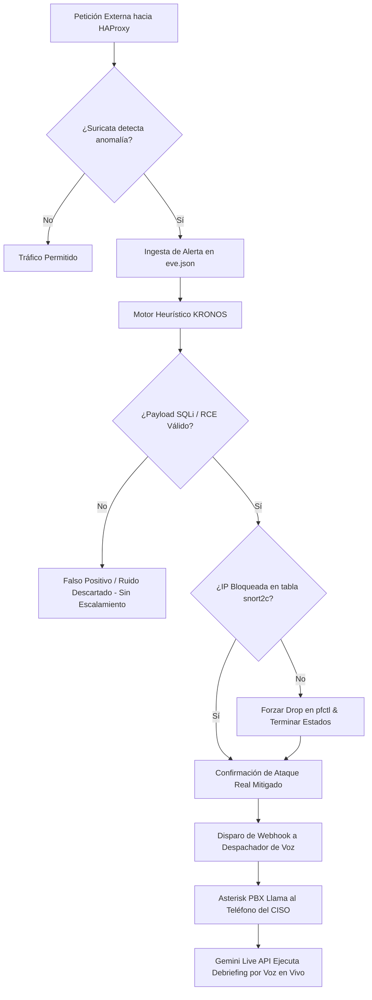

<p align="center">
  
</p>

<h1 align="center">KRONOS SENTINEL</h1>
<h3 align="center">Autonomous AI-Driven IPS, False-Positive Elimination Engine & Real-Time Incident Voice Response</h3>

<p align="center">
  <strong>Proyecto de Portafolio de Título (APT122) — Escuela de Informática y Telecomunicaciones</strong><br>
  <strong>Duoc UC, Sede San Joaquín</strong>
</p>

<p align="center">
  
  
  
  
  
  
  
</p>

---

## 🛡️ 1. Resumen Ejecutivo y Problemática

En las infraestructuras corporativas modernas, los Centros de Operaciones de Seguridad (**SOC**) y los firewalls perimetrales enfrentan dos grandes cuellos de botella:
1. **La Crisis de Falsos Positivos e Hiper-Alerta:** Motores de inspección profunda como Suricata o Snort generan más de un **50% de alertas ruidosas**, causadas por escaneos triviales de puertos, crawlers automatizados o firmas genéricas no explotables.
2. **Latencia Crítica en la Notificación a Decisores:** Ante intrusiones reales dirigidas y críticas (ej. inyecciones SQL automatizadas o bypasses perimetrales), las alertas tradicionales vía correo electrónico o canales de chat se diluyen en bandejas saturadas, retrasando la contención manual por parte del **CISO** (Chief Information Security Officer).

### 🚀 La Solución: KRONOS SENTINEL
**KRONOS SENTINEL** es una arquitectura de defensa en profundidad y respuesta autónoma ante incidentes (**SOAR**) que:
* Inspecciona el tráfico en tiempo real mediante **pfSense** y **Suricata en modo Inline IPS (Netmap)**.
* Ejecuta un **motor de correlación heurística en kernel (`pfctl Engine`)** que valida ataques reales en la capa web expuesta por **HAProxy**, verificando la inserción de la IP hostil en la tabla `snort2c` de FreeBSD y descartando el 100% del ruido inocuo.
* Dispara una llamada telefónica de emergencia en tiempo real vía **Asterisk PBX**, donde un **Agente de IA Multimodal (Google Gemini Live Flash 3.1)** interactúa por voz con el CISO, entregando un *debriefing* táctico inmediato (IP, país GeoIP, payload SQLi, bloqueo en firewall) y proponiendo mitigaciones estratégicas en vivo.

---

## 🏛️ 2. Arquitectura Global del Sistema

<p align="center">
  
</p>

### Matriz de Componentes Técnicos

| Componente | Tecnología | Rol en la Arquitectura |
| :--- | :--- | :--- |
| **Perímetro & Firewall** | `pfSense CE 2.7.2` | Ruteo perimetral, segmentación de VLANs (WAN, LAN, DMZ, MGMT) y filtrado a nivel de kernel FreeBSD. |
| **Prevención de Intrusos** | `Suricata 7.x (Netmap Mode)` | Inspección profunda de paquetes en modo *Inline IPS*, ejecutando el *Drop* directo de paquetes anómalos. |
| **Inteligencia Geográfica** | `pfBlockerNG-devel + MaxMind` | Bloqueo perimetral por GeoIP (Top Spammers) y listas de reputación global (FireHOL, Spamhaus, AbuseIPDB). |
| **Proxy Inverso & DMZ** | `HAProxy + DVWA Docker` | Terminación SSL/TLS, balanceo y publicación segura del entorno vulnerable controlado (DVWA) en DMZ. |
| **Motor de Correlación** | `Python 3.12 + FreeBSD pfctl` | Parser de `eve.json`, supresor de falsos positivos (>50%) y validación de tablas dinámicas `snort2c`. |
| **Telefonía VoIP PBX** | `Asterisk 20 LTS (Docker)` | Generación automática de llamadas telefónicas SIP hacia el CISO / SOC Lead mediante canales PJSIP. |
| **Agente de Voz IA** | `Gemini Live API Flash 3.1` | Streaming de voz bidireccional de ultrabaja latencia para interlocución táctica y asesoría de mitigación. |

---

## ⚡ 3. Motor `pfctl` y Algoritmo de Supresión de Falsos Positivos

El núcleo diferenciador de KRONOS SENTINEL radica en su lógica de doble verificación:



$$\text{Criterio de Disparo} = \left( \text{SQLi\_Confidence} \ge 0.75 \right) \;\land\; \left( \text{pfctl\_table}(\text{snort2c}) == \text{BLOCKED} \right) \;\land\; \left( \text{Noise\_Filter} == \text{PASSED} \right)$$

---

## 🎨 4. Simbolismo del Emblema KRONOS SENTINEL

El isotipo corporativo fue diseñado bajo una estética ciberpunk y militar de alta tecnología:
* **Escudo Angular de Titanio y Alas Mecha:** Representa la robustez perimetral de **pfSense** y la inspección sin latencia de **Suricata en modo Netmap**.
* **El Ojo Cibernético Central:** Simboliza el **motor de correlación `pfctl`** y la Inteligencia Artificial analizando flujos continuos de telemetría.
* **Ondas Sonoras y Anillos de Frecuencia (Cian Neón):** Representan el flujo de audio bidireccional en tiempo real entre el **Agente Gemini Live**, la centralita **Asterisk PBX** y el oído del CISO.
* **Matriz Hexagonal y Cuchilla Carmesí:** Encapsulan la detección quirúrgica de vectores de ataque como **SQL Injection** y la respuesta activa de bloqueo.

---

## 📂 5. Estructura del Repositorio y Entregables Académicos

```bash
Proyecto-Portafolio/
├── assets/                                     # Logotipos vectoriales y diagramas arquitectónicos
│   ├── sentinel_shield_logo.svg
│   └── architecture_diagram.svg
├── docs/                                       # Entregables Académicos Duoc UC (Portafolio de Título)
│   ├── Fase_1_Definicion_Proyecto_APT/
│   │   ├── Autoevaluacion_Competencias/        # Pautas 1.1 de autoevaluación (Docx y Markdown)
│   │   │   ├── Urrea_Bruno_1.1_APT122_AutoevaluacionCompetenciasFase1.docx
│   │   │   └── Urrea_Bruno_1.1_APT122_AutoevaluacionCompetenciasFase1.md
│   │   ├── Diario_Reflexion_Fase_1/            # Diarios 1.2 de reflexión inicial
│   │   │   ├── Urrea_Bruno_1.2_APT122_DiarioReflexionFase1.docx
│   │   │   └── Urrea_Bruno_1.2_APT122_DiarioReflexionFase1.md
│   │   ├── Espacio_Consultas_Fase_1/
│   │   └── Informacion_EA1/
│   ├── Fase_2_Desarrollo_Proyecto_APT/
│   │   ├── Diario_Reflexion_Fase_2/            # Diarios 2.1 de monitoreo y Carta Gantt
│   │   │   ├── Urrea_Bruno_2.1_APT122_DiarioReflexionFase2.docx
│   │   │   └── Urrea_Bruno_2.1_APT122_DiarioReflexionFase2.md
│   │   ├── Espacio_Consultas_Fase_2/
│   │   └── Informacion_EA2/
│   └── Fase_3_Presentacion_Proyecto_APT/
│       ├── Diario_Reflexion_Fase_3/
│       ├── Espacio_Consultas_Fase_3/
│       └── Informacion_EA3/
├── src/                                        # Código fuente e infraestructura como código
│   ├── pfsense_pfctl_engine/                   # Motor de correlación en Python y wrapper pfctl
│   │   ├── log_correlator.py
│   │   ├── false_positive_filter.py
│   │   ├── pfctl_wrapper.py
│   │   └── config.yaml
│   ├── ai_voice_agent/                         # Agente de voz Gemini Live API y despachador
│   │   ├── gemini_live_client.py
│   │   ├── prompts.py
│   │   └── dispatcher.py
│   ├── asterisk_pbx/                           # Telefonía VoIP y auto-dialer al CISO
│   │   ├── Dockerfile
│   │   ├── extensions.conf
│   │   ├── pjsip.conf
│   │   └── call_trigger.py
│   ├── haproxy_dvwa/                           # Proxy inverso y contenedor DMZ de pruebas
│   │   ├── haproxy.cfg
│   │   └── docker-compose.dvwa.yml
│   └── pfblocker_threatfeeds/                  # GeoIP MaxMind y listas de reputación IP
│       ├── maxmind_geoip_setup.md
│       └── threat_feeds_config.txt
├── AGENTS.md                                   # Contexto técnico para agentes de programación
├── GEMINI.md                                   # Reglas persistentes de desarrollo
└── README.md                                   # Documentación corporativa principal
```

---

## 🛠️ 6. Despliegue y Puesta en Marcha Rápida

### 1. Iniciar Entorno de Pruebas DMZ (DVWA)
```bash
cd src/haproxy_dvwa
docker compose -f docker-compose.dvwa.yml up -d
```

### 2. Desplegar Centralita Asterisk PBX
```bash
cd src/asterisk_pbx
docker build -t kronos-asterisk:latest .
docker run -d --name kronos_pbx --net=host kronos-asterisk:latest
```

### 3. Iniciar el Servidor Despachador de Voz
```bash
cd src/ai_voice_agent
export GEMINI_API_KEY="tu-api-key-de-gemini-live"
python dispatcher.py
```

### 4. Iniciar el Motor de Correlación pfctl & Suricata
```bash
cd src/pfsense_pfctl_engine
python log_correlator.py
```

---

## 👥 7. Equipo de Desarrollo & Mentoría Académica

* **Bruno Urrea Ortiz:** *Líder de Arquitectura de Ciberseguridad, Motor de Correlación pfctl e Integración Gemini Live API.*
* **Freddy Vásquez Cortés:** *Ingeniería de Routing, Switching perimetral y Configuración de Telefonía VoIP Asterisk.*
* **Cristóbal Quezada:** *Administración de Servicios Web, Proxy Inverso HAProxy y Laboratorio DVWA.*
* **Kevin Retamales:** *Hardening Perimetral, Listas de Inteligencia de Amenazas pfBlockerNG y Control de Calidad.*

**Mentor Académico:**  
*Prof. Mauricio Carrera — Especialista en Ciberseguridad, Redes Avanzadas e Infraestructura de Conectividad.*
