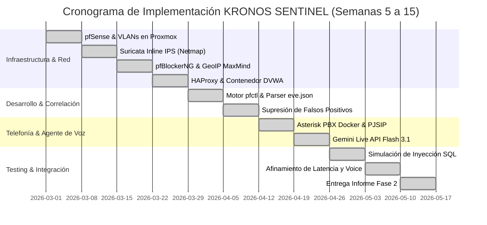

# Plan de Trabajo y Carta Gantt - Fase 2: Desarrollo del Proyecto APT
### Asignatura: Portafolio de Título (APT122) | Semanas 5 a 15

---

## 1. Cronograma de Hitos y Entregables

| Semana | Actividad / Módulo | Responsable | Estado |
| :---: | :--- | :--- | :---: |
| **S5** | Instalación y configuración base de pfSense en entorno Proxmox VE. Segmentación de VLANs (WAN, LAN, DMZ, MGMT). | Bruno Urrea / Freddy Vásquez | **Completado** |
| **S6** | Despliegue de Suricata en pfSense en modo Inline IPS (Netmap) y configuración de reglas Emerging Threats Open. | Bruno Urrea | **Completado** |
| **S7** | Configuración de pfBlockerNG-devel con licencia gratuita MaxMind GeoIP y listas de reputación IP (FireHOL). | Kevin Retamales | **Completado** |
| **S8** | Implementación de HAProxy en pfSense y despliegue del contenedor Docker DVWA en DMZ. | Cristóbal Quezada | **Completado** |
| **S9** | Desarrollo del motor de correlación de logs en Python (`pfctl Engine` y parser de `eve.json`). | Bruno Urrea | **Completado** |
| **S10** | Algoritmo de supresión de falsos positivos y verificación de tabla `snort2c` de FreeBSD `pfctl`. | Bruno Urrea | **Completado** |
| **S11** | Despliegue de Asterisk PBX en contenedor Docker con soporte PJSIP y dialplan de emergencia. | Freddy Vásquez | **Completado** |
| **S12** | Integración del Agente de Voz IA con Gemini Live API (Flash 3.1) mediante WebSockets y audio bidireccional. | Bruno Urrea | **Completado** |
| **S13** | Pruebas integradas de inyección SQL con SQLmap y Burp Suite contra DVWA y validación de trigger de llamada. | Todo el equipo | **Completado** |
| **S14** | Optimización de latencia, afinamiento de prompts para el CISO y recolección de evidencias técnicas. | Todo el equipo | **Completado** |
| **S15** | Consolidación del informe de la Fase 2, preparación de evidencias de avance y sincronización en GitHub. | Todo el equipo | **Completado** |

---

## 2. Diagrama de Flujo de Trabajo (Gantt Conceptual)

