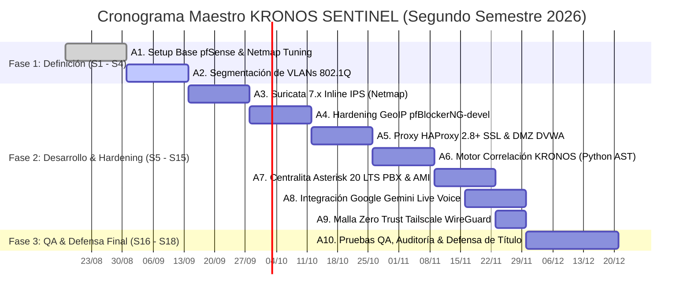

# Plan de Trabajo y Carta Gantt Oficial - KRONOS SENTINEL
### Asignatura: Portafolio de Título (APT122 — Asignatura Capstone)
**Institución:** Duoc UC — Sede San Joaquín  
**Escuela:** Escuela de Informática y Telecomunicaciones  
**Carrera:** Ingeniería en Conectividad y Redes  
**Semestre Académico:** Segundo Semestre 2026 (Primavera 2026: Agosto – Diciembre 2026)  
**Equipo de Proyecto:**  
* **Bruno Urrea Ortiz:** Líder de Ciberseguridad, Motor KRONOS y Gemini Live API  
* **Freddy Vásquez Cortés:** Ingeniería de Routing, Switching Perimetral y Telefonía Asterisk PBX  
* **Cristóbal Quezada:** Administración de Servicios Web, Proxy Inverso HAProxy y DMZ  
* **Kevin Retamales:** Hardening Perimetral, Inteligencia pfBlockerNG y Control de Calidad QA  

---

## 1. Cronograma Maestro de Hitos y Entregables (18 Semanas Académicas)

A continuación se detalla la planificación cronológica oficial de **KRONOS SENTINEL** distribuida en las 18 semanas lectivas del segundo semestre de 2026, vinculando cada actividad con sus responsables y estado real de ejecución:

| Fase | Semanas | Fechas Calendario | Actividad / Hito | Responsable(s) | Estado Actual |
| :---: | :---: | :---: | :--- | :--- | :---: |
| **Fase 1** | **S1 – S2** | 17/08/2026 – 30/08/2026 | **A1. Setup Base pfSense & Netmap Tuning:** Instalación de pfSense CE 2.9.0 en hipervisor, asignación de interfaces WAN/LAN, tuning de kernel FreeBSD (`net.inet.ip.fastforwarding=0`), cuadruplicación de mbufs y desactivación de Hardware Offloading (TSO/LRO). | Bruno Urrea / Freddy Vásquez | **Completado (100%)** |
| **Fase 1** | **S3 – S4** | 31/08/2026 – 13/09/2026 | **A2. Segmentación de VLANs 802.1Q:** Configuración de troncal 802.1Q, direccionamiento CIDR para VLAN 10 (Corp), VLAN 20 (DMZ), VLAN 30 (VoIP), VLAN 99 (Mgmt), servidores DHCP y políticas de aislamiento inter-VLAN. | Freddy Vásquez | **En Ejecución** |
| **Fase 2** | **S5 – S6** | 14/09/2026 – 27/09/2026 | **A3. Despliegue de Suricata Inline IPS:** Integración de Suricata 7.x sobre framework Netmap en interfaces WAN/LAN, descarga de firmas Emerging Threats Open y reglas automáticas `dropsid.conf`. | Bruno Urrea / Kevin Retamales | **Planificado** |
| **Fase 2** | **S7 – S8** | 28/09/2026 – 11/10/2026 | **A4. Hardening GeoIP con pfBlockerNG-devel:** Integración de API de MaxMind GeoLite2, bloqueo de países de alto riesgo (Top Spammers) y suscripción a feeds de reputación FireHOL L1 y Spamhaus DROP. | Kevin Retamales | **Planificado** |
| **Fase 2** | **S9 – S10** | 12/10/2026 – 25/10/2026 | **A5. Proxy HAProxy 2.8+ SSL & DVWA DMZ:** Configuración de frontend HTTPS 443 con SSL Offload, parametrización de *Stick-Tables* de control de tasa anti-fuzzing L7 en RAM y publicación de DVWA en VLAN 20. | Cristóbal Quezada | **Planificado** |
| **Fase 2** | **S11 – S12** | 26/10/2026 – 08/11/2026 | **A6. Motor de Correlación KRONOS:** Desarrollo en Python 3.12 del daemon de análisis de logs `eve.json`, filtro sintáctico heurístico AST (>50% supresión de falsos positivos) y wrappers de kernel `pfctl` (`pfctl -k` y tabla `snort2c`). | Bruno Urrea | **Planificado** |
| **Fase 2** | **S13 – S14** | 09/11/2026 – 22/11/2026 | **A7. Centralita Asterisk 20 LTS PBX & AMI:** Despliegue en Docker, canalización PJSIP, configuración de Dialplans prioritarios y script auto-dialer AMI (`Originate`) disparado por eventos críticos. | Freddy Vásquez | **Planificado** |
| **Fase 2** | **S14 – S15** | 16/11/2026 – 29/11/2026 | **A8. Integración Google Gemini Live Voice API:** Desarrollo del cliente WebSocket seguro (WSS), streaming de audio bidireccional PCM 24kHz y System Prompts tácticos de ciberseguridad para debriefing al CISO. | Bruno Urrea | **Planificado** |
| **Fase 2** | **S15** | 23/11/2026 – 29/11/2026 | **A9. Malla VPN Zero Trust Tailscale:** Configuración de Tailscale Subnet Router en pfSense para publicación segura de la subred VoIP `192.168.30.0/24` hacia softphones remotos sin exponer puertos ni depender de IP fija. | Freddy Vásquez | **Planificado** |
| **Fase 3** | **S16 – S18** | 30/11/2026 – 20/12/2026 | **A10. QA Integral, Auditoría & Defensa de Título:** Pruebas de penetración SQLi simuladas, verificación de descarte en kernel (<100 ms), medición de latencia total de respuesta (<1.5 s), manuales técnicos PDF y defensa final. | Todo el Equipo | **Planificado** |

---

## 2. Diagrama de Flujo de Trabajo (Carta Gantt Oficial en Mermaid)

El siguiente diagrama visualiza el avance cronológico y los estados de cada actividad conforme al calendario oficial del **Segundo Semestre 2026 (Agosto – Diciembre 2026)**:

---

## 3. Matriz de Factores Operacionales (Facilitadores, Obstaculizadores y Mitigaciones)

| Actividad | Facilitadores Técnicos | Obstaculizadores Potenciales | Estrategia de Mitigación Implementada |
| :--- | :--- | :--- | :--- |
| **A1. Setup pfSense** | Documentación oficial de Netgate y amplia experiencia previa en virtualización Proxmox VE. | Incompatibilidad del framework Netmap con aceleración por hardware (TSO/LRO). | Desactivación explícita de hardware offloading vía WebGUI y script de tuning en `/boot/loader.conf.local`. |
| **A2. VLANs 802.1Q** | Soporte nativo de etiquetado 802.1Q en pfSense y switches virtuales Linux bridge en Proxmox. | Riesgo de fuga de tráfico o ruteo no autorizado entre subredes corporativas y DMZ. | Implementación de reglas flotantes de Default Deny y aislamiento estricto de inter-VLAN routing. |
| **A3. Suricata IPS** | Capacidad de Netmap para realizar descarte en ring-buffers de memoria sin pasar por el stack IP. | Generación excesiva de alertas ruidosas y consumo elevado de CPU. | Filtrado previo de firmas con `dropsid.conf` y asignación de cores dedicados en el hipervisor. |
| **A4. pfBlockerNG** | Disponibilidad de listas de reputación públicas reconocidas (FireHOL L1, Spamhaus DROP). | Saturación de memoria RAM en pfSense por tablas de estados IP masivas. | Ajuste del parámetro `pfr_table_entries` a 2,000,000 de entradas en la configuración del kernel. |
| **A5. HAProxy SSL** | Módulo de Stick-Tables en RAM con procesamiento de peticiones en microsegundos. | Gestión de certificados SSL para nombres de dominio en entornos de laboratorio aislados. | Generación de una Autoridad Certificadora (CA) interna autofirmada instalada en clientes de prueba. |
| **A6. Motor KRONOS** | Módulo estándar `ast` de Python 3.12 y soporte nativo de utilidades FreeBSD (`pfctl`). | Restricciones de privilegios de usuario para manipular tablas de kernel en pfSense. | Configuración de directivas `sudoers` restringidas con alias de comando exclusivo para `/sbin/pfctl`. |
| **A7. Asterisk PBX** | Estabilidad del protocolo SIP/PJSIP y empaquetamiento liviano en contenedor Docker. | Dificultades de NAT traversal en flujos de señalización SIP y transporte RTP. | Configuración de directivas `local_net` y `external_media_address` en `pjsip.conf`. |
| **A8. Gemini Live** | Latencia ultra baja (<400 ms) en streaming de audio dúplex a través del Free Tier de Google AI Studio. | Desincronización o distorsión de audio al convertir flujos RTP telefónicos a WebSockets. | Normalización de códecs a PCM lineal 24 kHz mono en el puente de audio asíncrono. |
| **A9. Malla Tailscale** | Protocolo WireGuard integrado capaz de atravesar cualquier CGNAT o cortafuegos corporativo. | Conflictos de enrutamiento con redes locales existentes del operador remoto. | Anuncio exclusivo de la subred VoIP (`192.168.30.0/24`) y aprobación controlada en panel admin. |
| **A10. QA & Defensa** | Modularidad de la arquitectura que permite aislar cada componente ante contingencias. | Variabilidad en la conectividad a Internet durante la defensa presencial ante la comisión. | Preparación de un entorno de respaldo local con softphone SIP en LAN física y datasets precargados. |
